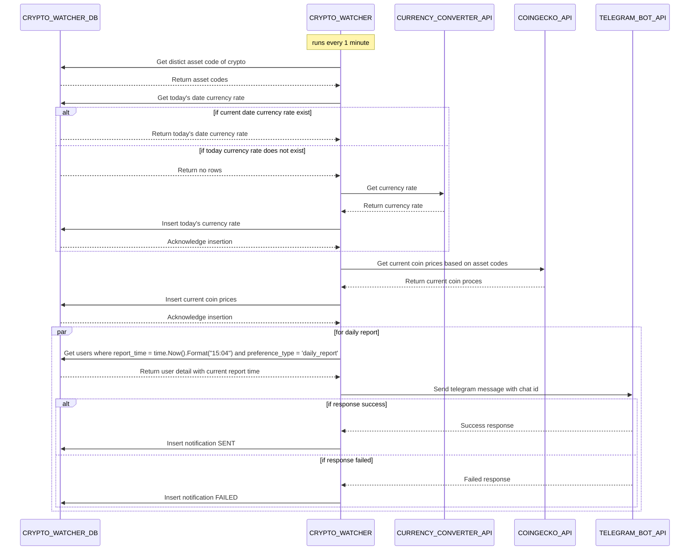

# Crypto Watcher - Backend  

Crypto Watcher is a dynamic monitoring & alerting system designed to track your cryptocurrency watch list in real-time. It provides detailed reports on cryptocurrency performance and sends timely notifications via Telegram to keep users updated on significant changes and trends.

## Features
- **Monitor Cryptocurrencies**: Continuously track the price and performance of various cryptocurrencies.
- **Report Cryptocurrencies**: Generate detailed reports on cryptocurrency metrics, providing insights into historical performance and current status.
- **Send Notifications via Telegram**: Leverage Telegram to send instant alerts about critical price changes based on user preferences.

## Architecture

[Cost Estimate Summary](https://cloud.google.com/products/calculator/estimate-preview/CiRhM2E1MzBjMi0wODI4LTQ1MjEtOTU1NC03Y2QzNjE2ZmRjOTUQAQ%3D%3D)

## Sequence Diagram

## Database ERD
  
[DBDiagram](https://dbdiagram.io/d/661ab47403593b6b61e97fb8)